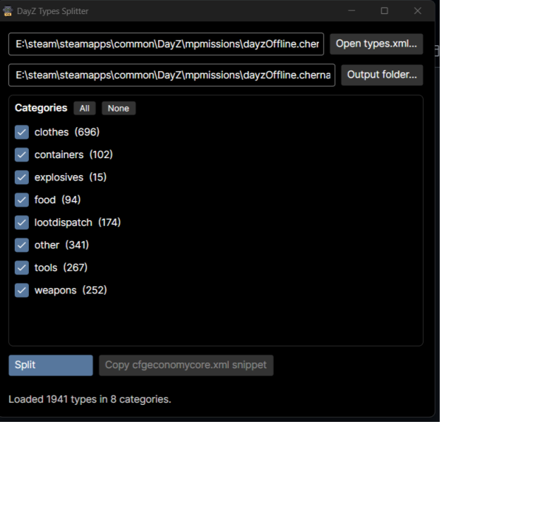

# DayZ Types Splitter

[](https://github.com/Borcioo/Dayz-Types-Splitter/actions/workflows/ci.yml)
[](https://github.com/Borcioo/Dayz-Types-Splitter/actions/workflows/codeql.yml)

Splits a DayZ `types.xml` into one file per category (`types_weapons.xml`,
`types_food.xml`, …) and generates the `cfgeconomycore.xml` snippet that
registers them on your server. Types without a `<category>` element land in
`types_other.xml`.



## Download

Grab the latest exe from [Releases](https://github.com/Borcioo/Dayz-Types-Splitter/releases) —
no Python, no .NET install, nothing else needed. A Linux build is there too.

**Is this safe?** Every release is built by GitHub Actions straight from the
tagged source commit — no hand-uploaded binaries. You can verify it yourself:

```
gh attestation verify DayZ-Types-Splitter.exe --repo Borcioo/Dayz-Types-Splitter
```

`SHA256SUMS.txt` ships with every release, and the release body links a
VirusTotal scan. Windows SmartScreen may still warn on a fresh release
(unsigned binary with no download history yet) — the attestation above is the
strong proof of where the file came from.

## Usage

**GUI** — run the exe, drop a `types.xml` anywhere in the window (or click
*Open*), tick the categories you want, *Split*. Then *Copy cfgeconomycore.xml
snippet* and paste it into your mission's `cfgeconomycore.xml`.

**CLI** — for scripts and server pipelines:

```
DayZ-Types-Splitter.exe path\to\types.xml path\to\output_dir
```

Splits all categories and prints the cfgeconomycore snippet.

## Building from source

```
dotnet build TypesSplitter.sln
dotnet test
dotnet run --project src/TypesSplitter
```

Stack: .NET 8, [Avalonia](https://avaloniaui.net/) (Fluent dark), CommunityToolkit.Mvvm.
Core split logic lives in `src/TypesSplitter.Core` (no UI dependencies), unit-tested
in `tests/TypesSplitter.Tests`.

## Legacy

The original Python/tkinter version and the `SpawnObject` `.c` → `.json`
converter live in [`legacy/`](legacy/). The converter still works:

```
python legacy/DayZ-C_to_Json_Spawn_Points/C_to_Json_Spawn_Points.py
```
